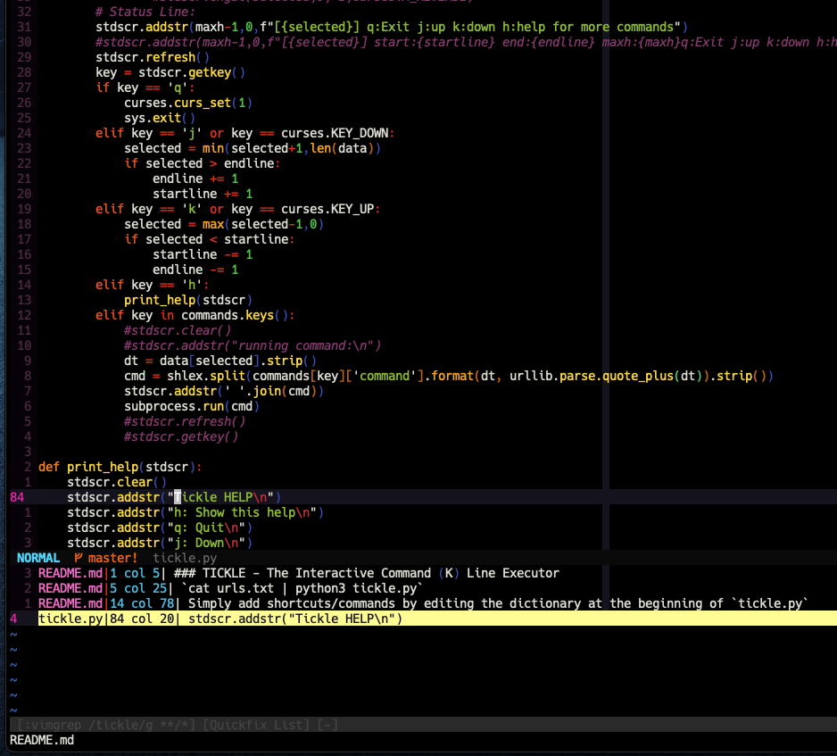

## maracuja colorscheme for vim

The juicy & tasty colorscheme. I'm mostly ignoring term support 

### Installation:

uh something like:
```
Plug 'r0bre/maracuja.vim'
```
i guess? (using plug obviously..)


### Screenshot:


